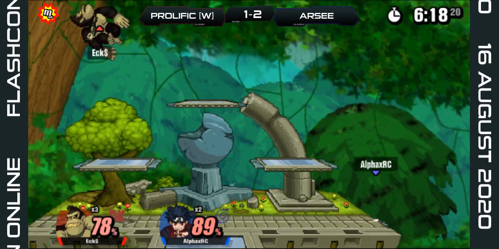

# Overlay v11
This ends the "New Overlay" moniker. This overlay was first used in its original form at *MGCS: Flashcon Online* on 16 August 2020 and last used in its original form at *MGCS: Flashmas II* on 5 December 2020. It was later modified and used as a multistream chiron for various broadcasts even long into the CoreOverlay era. It is built on Scoreboard Assistant, and is required to use unmodified.

## Omitted components
- Font: [Sui Generis](https://www.dafont.com/sui-generis.font)
- Engine: [Scoreboard Assistant](https://obsproject.com/forum/resources/scoreboard-assistant.112/)

